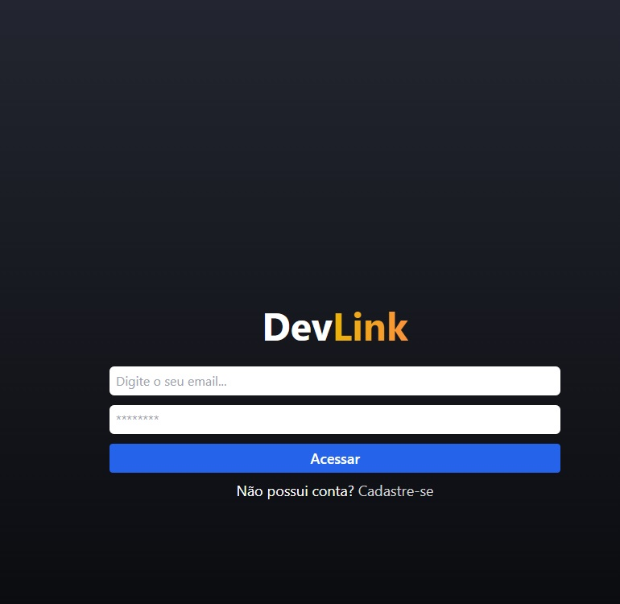
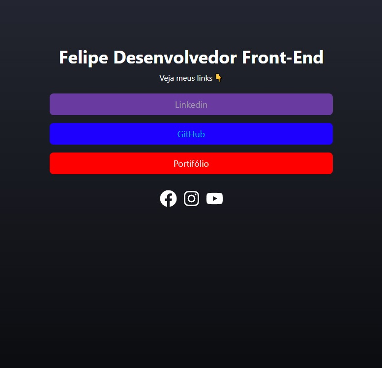
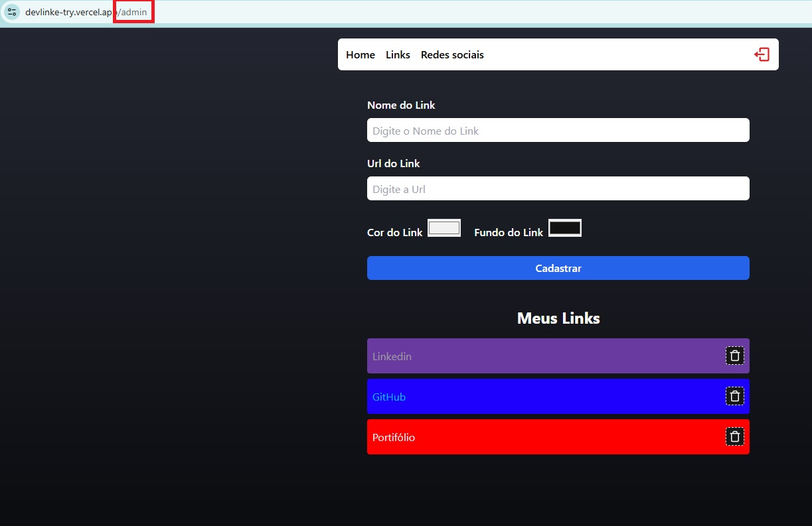
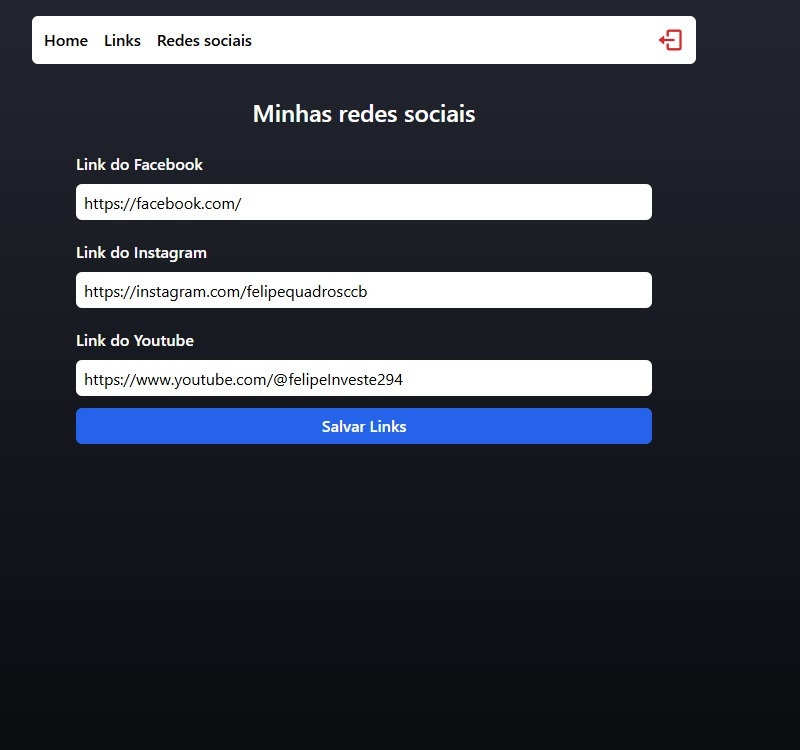

## Descrição
Este é um projeto de gerenciamento de liketry é para armazenar todos seus links em um so lugar compartilhar e personalizar,e so podendo acessar /admin se estiver logado.

## Tecnologias Utilizadas
-**JavaScript**: Linguagem usada no desenvolvimento.

-**TypeScript**: Utilizado para tipagem e prevenção de erros em tempo real.

-**Firebase**: Autenticação para login.

-**Firestore**: Banco de dados NoSQL para armazenamento das tarefas.

## Funcionalidades
-Cadastro, edição e exclusão de tarefas.

-Compartilhamento de tarefas com outras pessoas.

-Tarefas privadas visíveis apenas para o usuário logados "/admin".

-Autenticação segura com firebase.

-Interface amigável e responsiva.

-Personalize com seu gosto.

## Contato
Email: felipedequadrosgomes@gmail.com

LinkedIn: https://www.linkedin.com/in/felipe-de-quadros-gomes-b990012aa/

Portfólio:https://portifolio-quadros.vercel.app/

